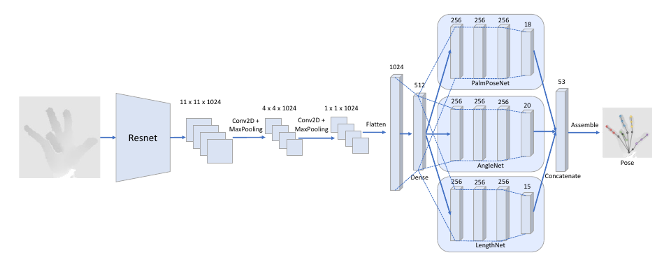

# SSC-CNN: Single Shot Corrective Convolutional Neural Network

## Introduction

This is the official implementation for the paper, "Single Shot Corrective CNN for Anatomically Correct 3D Hand Pose Estimation".

We present a novel approach that we call the Single Shot Corrective CNN (SSC-CNN) that provides a highly accurate hand pose estimation with no anatomical errors by applying corrective functions in the forward pass of the neural network using three separate networks. This ensures that the initial prediction from the network is free of anatomical errors and prevents the need for any correction using a post-processing function.

Please refer to our paper for more details.



## About our code

### Dependencies

Our code was tested under Ubuntu 16.04.6 LTS (GNU/Linux 4.4.0-124-generic x86_64) using a Titan X GPU. Our code uses Tensorflow-gpu 2.3.1 with CUDA 10.1 and CUDNN 7.

### Code

First clone the repository:
```python
git clone https://github.com/josephhri/SSCCNN
```

`src` folder contains the model files along with the necessary auxillary utilities file.

You will also have to download the HANDS2017 dataset manually from [here](https://competitions.codalab.org/competitions/17356).

### To train model from scratch
After downloading the dataset, convert `Training_Annotation.txt` and `test_annotation_frame.txt` into csv files. External tools such as MATLAB or MS Excel can do this task. Use `OneShotLabeller.py` to convert the training labels to a file called `oneShotLabelsTrain.csv` and the test labels to a file called `oneShotLabelsTest.csv` that is used on the training code. It can simply be executed after setting the arguments present in the code. The parts to edit are clearly shown in code.

```python
python OneShotLabeller.py
```

Use `ImageCropper.py` to preprocess the training images and test images to the input size of the SSC-CNN for training.

```python
python ImageCropper.py
```

Finally fill the folder locations for test and training images and the locations of `oneShotLabelsTrain.csv / oneShotLabelsTest.csv` in `DataGenerators.py` and run `SSCCNNTrainer.py`.

```python
python SSCCNNTrainer.py
```

### To test the pretrained or trained model

Run `SSCCNNTest.py` with either the pretrained model or the newly trained model.

```python
python SSCCNNTest.py
```
